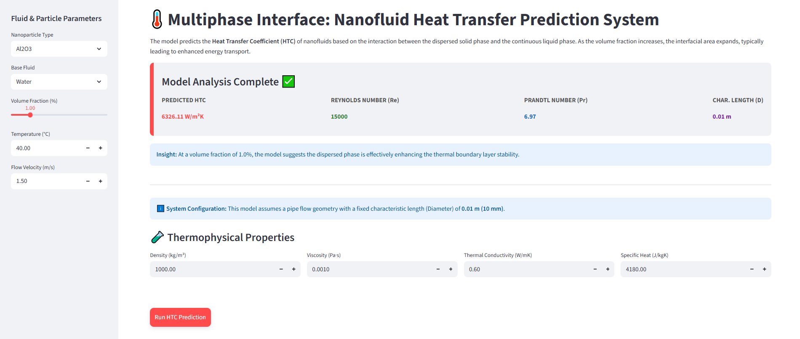
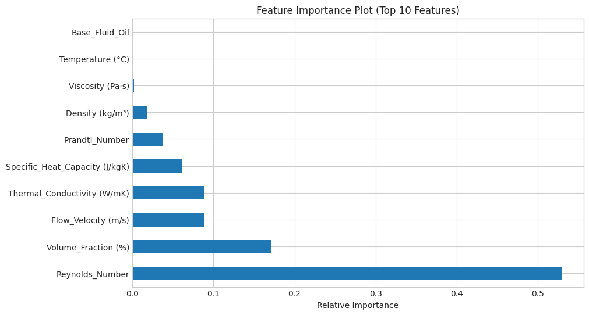
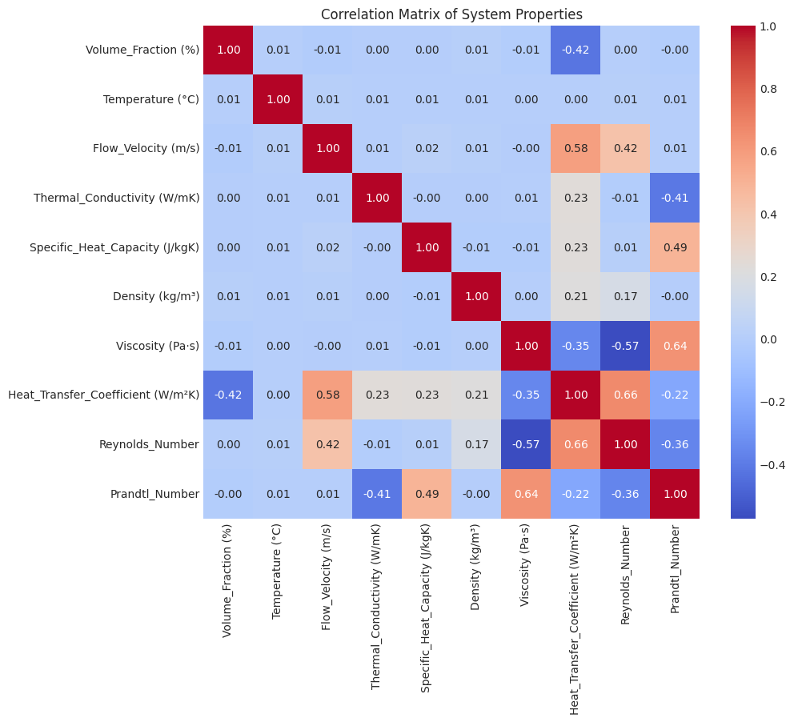

# Modeling Interfacial Energy Transport in Dispersed Solid-Liquid Nanofluids - A Machine Learning Approach

[Link to Live Nanofluid HTC Predictor App ✅:](https://nanofluid-htc-ml.streamlit.app/)

<p align="center">

</p>

This project implements a machine learning-based framework for predicting the convective Heat Transfer Coefficient (HTC) of nanofluids by analyzing the complex interaction between the dispersed solid phase and continuous liquid phase. The selected model achieves an **R2 Score of 0.9826** and a **RMSE of 425.98 W/m2K**, providing a real-time alternative to computationally intensive Eulerian-Lagrangian CFD simulations.

## 📌 Project Overview

Traditional modeling of heat transfer in nanofluids is often bottlenecked by the computational cost of tracking millions of nanoparticle-fluid interfaces. In industrial applications, waiting for CFD results is not always feasible for real-time control or rapid design iterations.

This project addresses this by developing a **Surrogate Model** that captures the non-linear energy transport dynamics at the solid-liquid interface. By integrating dimensionless numbers (Re and Pr), the model provides accurate thermal predictions across a wide range of nanoparticles and base fluids.

## 🛠️ Technology Used

* **Machine Learning:** XGBoost , Scikit-learn
* **Web Framework:** Streamlit
* **Data Science:** Pandas, NumPy
* **Visualization:** Matplotlib, Seaborn
* **Dataset:** [Nanofluid Dataset for HTC](https://www.kaggle.com/datasets/vimalsingh69/nanofluid-dataset-for-htc)

## 🔳 Key Features

* **Interfacial Energy Transport Modeling:** Specifically designed to analyze how the concentration of the dispersed solid phase (Volume Fraction) enhances the convective transport capacity across the fluid-particle interface.
* **Feature Engineering:** Transforms raw inputs into fundamental dimensionless groups: **Reynolds Number (Re)** and **Prandtl Number (Pr)**, ensuring the model respects fluid dynamics principles.
* **Multiphase Sensitivity Analysis:** Provides real-time insights into which thermophysical properties (Viscosity, Conductivity, Density) most impact the convective enhancement.


## 📁 Repository Structure

<pre>
├── data
│   └── nanofluid_dataset.csv
├── image_assets
│   └── dashboard_preview.png
├── model_assets
│   └── htc_pred_xgb_model.json
├── model_training
│   └── nanofluid_htc.ipynb
├── results
│   ├── correlation_heatmap.png
│   ├── feature_importance.png
│   ├── htc_vol_scatterplot.png
│   └── model_comparison.png
├── streamlit_app
│   └── nanofluid_htc_pred.py            
├── LICENSE
├── README.md
└── requirements.txt
</pre>

## 🚀 Getting Started

### 1. Clone the Repository

```bash
git clone https://github.com/Oluwatobi-coder/Nanofluid-HTC-ML.git
cd Nanofluid-HTC-ML

```

### 2. Install Dependencies

```bash
pip install -r requirements.txt

```

### 3. Run the App

```bash
streamlit run ./streamlit_app/nanofluid_htc_pred.py

```

## 📊 Results

The XGBoost architecture demonstrated exceptional performance in capturing the interfacial transport phenomena compared to the standard Random Forest approach.

<p align="center">

</p>

| Metric | Random Forest | **XGBoost (Best Model)** |
| --- | --- | --- |
| **R² Score** | 0.9636 | **0.9826** |
| **RMSE (W/m²K)** | 616.58 | **425.98** |

### Performance Insights

<p align="center">


</p>

* **Primary Predictor:** The **Reynolds Number** was identified as the primary driver of HTC, confirming that flow momentum is the fundamental transport mechanism.
* **Secondary Driver:** **Volume Fraction** showed a strong positive correlation, validating the theory that increased interfacial area directly enhances energy transport capacity.

## 🤝 Contributing

Contributions are welcome! Potential improvements include:

* Expanding the model to include hybrid nanofluids (two or more nanoparticle types).
* Integrating a neural network (ANN) approach to compare against tree-based ensembles.

## 📚 References

* Singh, V. (2025). Nanofluid Dataset For HTC. Kaggle. https://www.kaggle.com/datasets/vimalsingh69/nanofluid-dataset-for-htc


## 📜 License

This project is licensed under the MIT License - see the `LICENSE` file for details.

If you find this machine learning framework useful, please ⭐ the repository!
